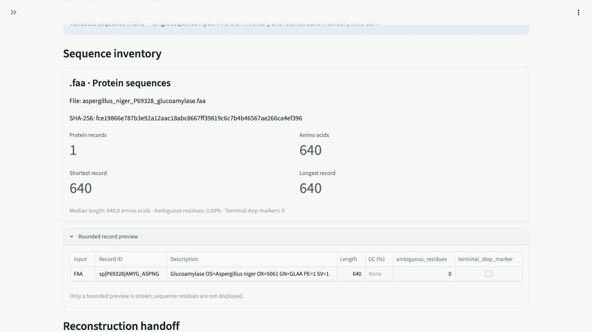

<p align="center">
  
</p>

# Myco Optima

Myco Optima is a small fungal fermentation modelling prototype created by Ziya Mammadov and Ibrahim Ayvazov for the Pacifico Biolabs challenge at Edinburgh BioHackathon 2026.

We built it to make metabolic modelling easier to explore for fermentation engineers who do not work with COBRA models every day. The app uses Python, COBRApy and Streamlit to turn media choices into readable FBA, FVA, sensitivity and experiment planning results.

## See it in action

[](assets/myco-optima-demo.mp4)

[Watch the 47-second walkthrough](assets/myco-optima-demo.mp4). It covers media optimisation, FVA, sensitivity-guided experiment design, the gene-media explorer, SBML intake and FASTA validation.

The FASTA shown in the video is the reviewed [UniProt P69328 glucoamylase](https://www.uniprot.org/uniprotkb/P69328/entry) from *Aspergillus niger*. A copy is included in [`examples/aspergillus_niger_P69328_glucoamylase.faa`](examples/aspergillus_niger_P69328_glucoamylase.faa) so the upload can be repeated locally.

## What it does

The app includes demonstration models for four industrial fungi:

- *Aspergillus niger*
- *Aspergillus oryzae*
- *Trichoderma reesei*
- *Fusarium venenatum*

You can change carbon, nitrogen, oxygen and mineral availability, then compare model-derived biomass flux, yield ratio and nutrient sensitivity. Sensitivity analysis ranks four candidate factors, keeps the top three and builds a 15-run Box-Behnken follow-up from an 81-condition reference space.

Tests confirm that the canonical coded template has balanced levels and a full-rank three-factor quadratic model matrix. A negative control shows that it cannot recover an effect from the excluded fourth factor. These are software checks, not biological validation. See [docs/DOE_VALIDATION.md](docs/DOE_VALIDATION.md).

There is also a gene-media explorer for simple morphology hypotheses. Its results come from explicit rules and should be treated as experimental leads, not confirmed biological outcomes.

## Published model case study

The repository includes the published iJB1325 genome-scale reconstruction for *Aspergillus niger* ATCC 1015. It contains 2,320 reactions, 1,818 metabolites, 1,325 genes and 471 embedded test cases.

Our COBRApy runner reproduced the [paper's result](https://doi.org/10.1186/s40694-018-0060-7): 373 of 471 cases passed. Because these cases informed model curation, this checks compatibility with the published workflow, not independent biological accuracy. See the [full case study](case_studies/aspergillus_niger_iJB1325/README.md).

## Using your own files

The Custom Model page accepts SBML, FNA and FAA files.

An SBML model can be used for FBA and selected-reaction FVA after it passes the model checks.

FNA and FAA uploads follow a different path. The app validates the FASTA file, counts records and residues, shows a short preview, and creates an inventory and reconstruction handoff. It does not annotate sequences or build a metabolic model from them.

FBA and FVA need a curated stoichiometric model with reaction bounds and an objective. If you start with FNA or FAA files, reconstruct and curate the model in a dedicated tool, export it as SBML, then upload that SBML file here.

The included fungal models are reduced teaching models. They are useful for exploring the workflow, but they are not substitutes for strain-specific reconstructions or wet-lab validation.

## Run locally

Python 3.11 or 3.12 is recommended.

```bash
git clone https://github.com/mammadovziya/myco-optima.git
cd myco-optima

python -m venv .venv
source .venv/bin/activate
python -m pip install -e '.[dev]'

streamlit run app.py
```

Open [http://localhost:8501](http://localhost:8501).

The modelling features work without an API key. Claude is only used for optional plain-language explanations of results that have already been calculated. To enable it, set `ANTHROPIC_API_KEY` before starting the app.

## Tests

```bash
pytest
ruff check .
```

The test suite covers optimisation, FVA, the published-model reproduction, DoE construction, morphology rules, SBML validation, FASTA uploads and export safety. GitHub Actions runs it on Python 3.11 and 3.12.

You can also run the project with Docker:

```bash
docker build -t myco-optima .
docker run --rm -p 8501:8501 myco-optima
```

More detail about the model assumptions and biological limits is in [docs/MODEL_ASSUMPTIONS.md](docs/MODEL_ASSUMPTIONS.md).

## Built by

Ziya Mammadov and Ibrahim Ayvazov created Myco Optima together for the [Pacifico Biolabs challenge](https://biohackathon-edinburgh-2026.devpost.com/) at Edinburgh BioHackathon 2026.

All numerical results come from deterministic code. Claude is optional and only explains results that have already been calculated.

Myco Optima is an independent open-source prototype and is not an official Pacifico Biolabs product. It is available under the [MIT License](LICENSE).
