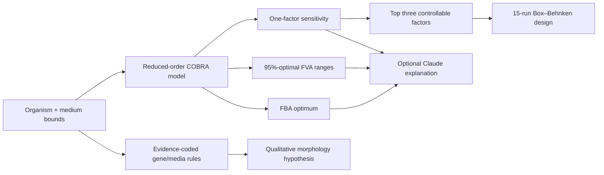

<p align="center">
  
</p>

<p align="center">
  A fungal fermentation optimisation workbench built with Python, COBRApy, Streamlit and an optional Claude explanation layer.
</p>

# Myco Optima

I started Myco Optima around a fairly ordinary fermentation problem: media
optimisation is powerful, but the modelling tools used to do it are often built
for people who already know how to read a metabolic network. At the Edinburgh
BioHackathon 2026, Pacifico Biolabs posed almost exactly that challenge—make
genome-scale metabolic modelling useful to non-specialists working on strain and
media optimisation.

This repository is the usable, documented version of that one-day idea. You can
choose an industrial fungus, change the available carbon, nitrogen, oxygen and
minerals, run FBA/FVA, see which inputs matter most, and turn that sensitivity
ranking into a 15-run follow-up experiment. There is also a small gene–media
module for exploring morphology hypotheses, because “more biomass” is not much
help if the resulting broth is impossible to mix.

The honest version: the four models bundled here are transparent reduced-order
surrogates, not validated genome-scale reconstructions. They make the workflow
runnable without downloading licensed or strain-specific GEMs. The application
is ready for exploration and teaching; a real process decision still needs a
curated model, fitted uptake bounds and wet-lab validation.

## What is in the app

- **Media Optimizer** runs a cost-aware media search and reports predicted
  growth, yield, limiting nutrients, FBA fluxes and 95%-optimal FVA ranges.
- **Sensitivity & DoE** perturbs the current medium, ranks the levers by local
  elasticity, and creates a downloadable follow-up design.
- **Gene–Media Explorer** combines explicit, cited regulatory rules with media
  context to return a qualitative morphology tendency and the full rule trace.
- **AI Interpretation** can ask Claude to explain an already-computed result in
  plain language. It is optional and cannot alter any numerical result.
- **Exports** are available as CSV and JSON so the interesting part can leave
  the dashboard and become an actual lab conversation.

The four demonstration profiles are *Aspergillus niger*, *Aspergillus oryzae*,
*Trichoderma reesei* and *Fusarium venenatum*. They cover organic-acid/enzyme,
food fermentation, cellulase and mycoprotein use cases respectively.

## Run it locally

Python 3.11 or 3.12 is recommended.

```bash
git clone https://github.com/mammadovziya/myco-optima.git
cd myco-optima

python -m venv .venv
source .venv/bin/activate                    # Windows: .venv\Scripts\activate
python -m pip install -e '.[dev]'

streamlit run app.py
```

Open [http://localhost:8501](http://localhost:8501). The whole modelling
workflow works without an API key.

For the optional Claude interpretation tab, use `.env.example` as a reference
and export `ANTHROPIC_API_KEY` before starting Streamlit. On macOS/Linux:

```bash
export ANTHROPIC_API_KEY="your-key-here"
streamlit run app.py
```

Do not put a real key in the repository or in `.streamlit/config.toml`.

## A useful first run

If you just want to see whether the project works, leave the default organism
and objective selected, then:

1. Open **Media Optimizer**, keep the starting medium, and run the analysis.
2. Look at the FVA chart. A wide range means the model can route flux in several
   equally good ways; it is not an error bar.
3. Open **Sensitivity & DoE** and generate the 15-run plan.
4. In **Gene–Media Explorer**, choose a supported perturbation such as *A. niger*
   `racA` knock-down. Expand the trace to see exactly which rule fired.
5. Download the design as CSV. That file—not the dashboard—is the natural handoff
   for protocol planning.

## Where the “about 80 runs to 15” comes from

A naive screen of four media/process factors at three levels contains 3⁴ = 81
conditions. Myco Optima uses the model sensitivity result to retain the three
highest-leverage factors, then lays out a three-factor Box–Behnken design:

- 12 interaction-edge conditions;
- 3 replicated centre conditions; and
- 15 runs in total, an 81.5% reduction from the original candidate grid.

This is deliberately phrased as a **follow-up design**. It prioritises the first
experiments; it does not prove that the other conditions can never be useful.
Biological replicates, controls, blocking and confirmation runs still need to be
chosen for the real organism and process.

## How the calculation is split up



The separation is intentional. COBRApy owns the linear optimisation. The
morphology module owns its small deterministic rule table. Claude only receives
structured outputs after those calculations are complete; it is never used to
invent fluxes, fill missing evidence or change a ranking.

More detail—including exchange-bound semantics, FVA interpretation and the
papers behind the gene rules—is in
[docs/MODEL_ASSUMPTIONS.md](docs/MODEL_ASSUMPTIONS.md).

## Repository map

```text
app.py                         Streamlit interface and download flows
src/myco_optima/catalog.py     organism and nutrient configuration
src/myco_optima/models.py      reduced-order COBRA model builder
src/myco_optima/optimization.py FBA, FVA, sensitivity and media search
src/myco_optima/doe.py         sensitivity-guided Box–Behnken design
src/myco_optima/gene_media.py  explicit morphology rule engine
src/myco_optima/ai.py          optional Anthropic interpretation boundary
tests/                         deterministic scientific and safety tests
docs/MODEL_ASSUMPTIONS.md      assumptions, evidence and limitations
```

## Tests and reproducibility

```bash
pytest
ruff check .
```

The tests check more than imports. They cover nutrient essentiality, deterministic
FBA and sensitivity rankings, valid FVA bounds, medium immutability, the exact
12-edge/3-centre experimental design, known morphology rules, unknown-gene
behaviour, and the optional Anthropic client boundary. GitHub Actions runs the
suite on Python 3.11 and 3.12.

For a container instead:

```bash
docker build -t myco-optima .
docker run --rm -p 8501:8501 myco-optima
```

## Things I would do next

The most important next step is not another chart. It is a model-import path for
proper SBML reconstructions, followed by strain-specific exchange calibration.
After that I would add saved projects, plate-layout exports, uncertainty from
measured uptake ranges, and a comparison view between predicted and observed
responses. Those features only become meaningful once real experimental data is
available.

## Context and credit

The project responds to the
[Pacifico Biolabs metabolic-modelling challenge](https://biohackathon-edinburgh-2026.devpost.com/)
at Edinburgh BioHackathon 2026. It uses
[COBRApy](https://cobrapy.readthedocs.io/) for constraint-based analysis,
[Streamlit](https://streamlit.io/) for the interface, and the official
[Anthropic Python SDK](https://platform.claude.com/docs/en/cli-sdks-libraries/sdks/python)
for the optional explanation layer.

Myco Optima is an independent open-source prototype and is not an official
Pacifico Biolabs product. It is released under the [MIT License](LICENSE).
